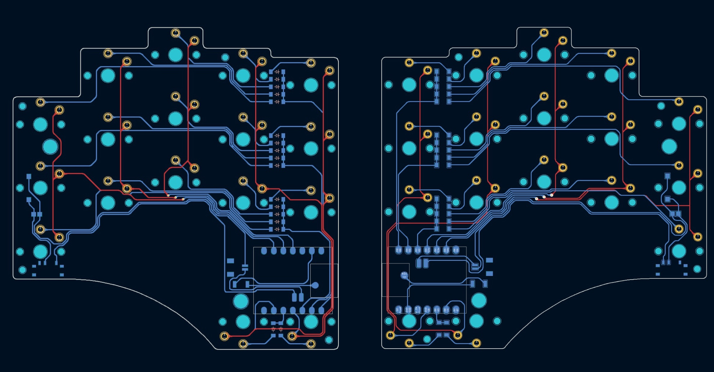

# Dyad Keyboard - Build Guide

Welcome to the build guide for your Dyad keyboard! This guide will take you through every step, from preparing the PCB to final assembly. 

You'll be soldering surface-mounted components, installing key switches, flashing firmware, testing connections, and assembling the case. By the end of this guide, you'll have a fully functional, compact, and travel-friendly keyboard designed for comfort and efficiency.  

Take your time, double-check each step, and enjoy the process. Let’s get started!  

[Link to main page](https://github.com/dyad-keeb/zmk-config-dyad/tree/main/README.md).

## Table of Contents
- [Tools List](#tools-list)
- [Install the Press-fit Nuts](#install-the-press-fit-nuts)
- [Install the Spring Pins](#install-the-spring-pins)
- [Solder Diodes, Power and Reset Switch, and Battery Connector](#solder-diodes-power-and-reset-switch-and-battery-connector)
- [Pre-tin the Microcontroller Pads](#pre-tin-the-microcontroller-pads)
- [Solder on the Microcontroller with a "Hotplate"](#solder-on-the-microcontroller-with-a-hotplate)
- [Check that Everything is Working](#check-that-everything-is-working)
- [Solder in the Key Switches](#solder-in-the-key-switches)
- [Trim the Protruding Pins Behind the Battery](#trim-the-protruding-pins-behind-the-battery)
- [Insert the Magnets and Install the Case Backs](#insert-the-magnets-and-install-the-case-backs)
- [Enjoy your Keyboard!](#enjoy-your-keyboard!)

## Tools List

| Component | Comment |
|-----------|-------------|
| Soldering Iron | A very fine soldering iron tip is preferred for surface mount connections. |
| Precision Tip Tweezers | These are very useful for orienting and holding the small components. |
| Hotplate | This is necessary to solder otherwise inaccessible connections between the microcontroller and PCB (I used my gas stove and a piece of aluminum). |
| Parallel Jaw Pliers | These aren't strictly necessary, but I found them very helpful for installing the press-fit nuts and spring pins into the PCB. |
| Hex Key | You'll need a tool to install whichever screws you decide on. The screws I've listed in the parts list take a 0.050" hex key. |
| Flush Cutters | These are used for cutting down some protruding pins from the back of the PCB where the battery is going to rest. |
| Multimeter | This is useful for double checking your components and workmanship, as well as troubleshooting. |

## Install the Press-fit Nuts

I designed Dyad to use press-fit nuts and spring pins so we can attach directly to the back of the PCB without any exposed mounting hardware (the holes in the PCB are covered by the key switches on the other side) or having to wrap around the edges. The press-fit nuts are low-profile, easy to install, and rock solid. The spring pins provide tight, precise alignment with high shear strength, allowing us to use fewer and smaller screws while still keeping everything secure.  

It's best to start the build with the press-fit nuts since they require some force to install, and you don’t want to risk slipping and damaging other components. The nuts I’ve linked in the parts list actually cut into the PCB material as they’re inserted, creating enough friction to stay put permanently. Once they’re in, they’re *in*. The key is to go slow and prevent the PCB from flexing too much during installation.  

I found that parallel jaw pliers work great for pressing the nuts into place. Since I was worried about putting too much stress on the PCB, I used a small aluminum plate as a backing to distribute the force evenly. In some cases, I had to work one side of the nut down first and then the other. The goal is to get them perfectly flush with the PCB surface with no gaps.  

  

Once the nuts are in, we can move on to installing the spring pins–so don’t put those pliers away just yet.  

## Install the Spring Pins

Spring pins are designed to be squeezed when installed, meaning that once they’re in, they constantly push outward against the walls of the hole. This allows for a bit more tolerance in both the PCB and the printed case while still benefiting from a strong double press-fit connection.  

That doesn’t mean they’re easy to install! The pin needs to be compressed so its diameter is smaller than the hole, while also being aligned and pushed in—all at the same time. It sounds easier than it is. But with persistence and patience, they *will* go in. And it’s worth it, because they’re the secret to making the case-to-PCB attachment feel so solid.  

### Tips for Installation  

I found it helpful to take extra time to carefully align the pin in the pliers before attempting to push it into the PCB. If it’s not well aligned, it will pivot around when pressed against the PCB, making installation harder. Once the pin is in place, it’s very secure and won’t come out without intentional effort.  

After the spring pins have started to insert into the PCB holes, a slight twisting motion can help bring them to full depth. It also helps to have the PCB resting on a solid, flat surface—like the aluminum plate used earlier. Insert the pins until they are flush with the top side of the PCB, but *not* protruding. Key switches will still need to be installed from the front in a later step.  

Once the spring pins are in, we’re ready to start soldering electrical components.  

> **Note:** I installed my spring pins much later in the build process, so you’ll see them *missing* in some of the next photos. I recommend not doing what I did—install them right after the press-fit nuts.

## Solder Diodes, Power and Reset Switch, and Battery Connector

Now we're going to solder everything *except* the microcontroller and key switches. Since all of these components are surface-mount, a precision tip for your soldering iron will be extremely helpful. 

If you're already familiar with using solder paste and hot plates, then you probably don't need to read the next couple sections. You can still read on to get a good laugh out of the scrappy way I got it done with what was on hand.

The component orientation either does it matter or self-explanatory for all of the parts except the diodes. The day is obviously only allow current to flow in one direction, so the keyboard wouldn't work as expected if they're installed backwards. Dyad has the required diode orientation printed into the silk screen layer of the PCB with the standard schematic symbol. All you need to know to get this right is that there is a line printed on the top of the diode (it might be faint, but it's there) which needs to be oriented on the same side as the line in the schematic symbol (the one that the arrow is pointing to). Most micro controllers also have a diode check mode that will allow you to verify the directionality of your diode along with the voltage drop across it.

### Recommended Soldering Steps  

1. **Pre-tin one half of the pads.** Use a small amount of solder—less is better than too much, since you can always add more later.  
2. **Place the component.** Hold it in place with tweezers while melting the pre-tinned pad with your soldering iron. Ensure the component is flush against the board and the other lead is aligned with its pad. Remove the soldering iron *before* letting go of the component, and allow a few seconds for the solder to solidify.  
3. **Solder the second pad.** Heat the second pad and lead for a few seconds, then apply a tiny dip of solder to match the first side. Hold the iron in place briefly to let the solder flow properly into the joint.  
4. **Repeat for all remaining components, excluding the microcontroller and key switches.**  

> **Note:** Be sure to trim any plastic alignment nubs that may be sticking out from the bottom of your components. I didn’t include holes for them in the PCB layout because I didn’t want them showing through the other side. If these nubs aren’t removed, the component won’t sit flush against the PCB.  

For components with more than two solder pads, start by soldering *one* pad to hold the component in place. Then follow the same process for the remaining pads. The power slider switch and battery socket connector have extra pads beyond their electrical connections—be sure to solder *all* of them. These extra solder points help structurally secure the components to the board, reinforcing them against repeated use.  

  

Alignment isn’t *super* critical at this stage. You might notice some of your components look a little crooked—that's fine! In the next step, we'll use a hot plate, which will reflow the solder and allow surface tension to pull everything into place for a cleaner final look.

## Pre-tin the Microcontroller Pads

Next, we're prepping the board to solder the microcontroller using a hot plate. Technically, the "proper" way to do this is with solder paste and a reflow station, but I'll admit—I don't have that setup. Instead, I made it work with regular solder wire, the same aluminum plate we've been using, and a gas stove.  

What we're doing here is applying a *tiny* amount of solder to each pad where the microcontroller will sit. You can see in the image below just how little is needed—it's just barely domed. Less is definitely better in this case, because any excess solder could create a short between the microcontroller and the PCB. These two boards will be pressed *right* up against each other, so there's not much room for excess material without spreading into a wide, but thin layer.  

  

Be sure to pre-tin the three smaller pads in the middle of the two rows—these are for the reset button and battery terminals. These pads are completely inaccessible with a soldering iron once the microcontroller is placed, which is why we're using the hot plate method.  

For comparison, the Totem keyboard also uses Seeed Studio’s XIAO microcontrollers but gets around this issue by cutting holes through the PCB, allowing builders to solder from the reverse side into cross-sectioned vias. That’s a totally valid approach, and it lets you stick to just using a soldering iron. But personally, I really don’t like how it looks, and since I wasn’t planning on covering this section with a case anyway... here we are.  

Ready for the fun part?

## Solder on the Microcontroller with a "Hotplate"

I imagine there are probably some safety precautions I *should* be writing into this section. And I’m sure there are people who actually know what they’re doing who are screaming at their screens right now. Just don’t be stupid and burn something down. Keep a constant eye on the temperatures.  

Now, we’re going to heat the entire PCB evenly to melt all the solder at once, rather than going pad by pad with a soldering iron. This will reflow the pre-tinned solder pads under the microcontroller, pulling it down onto the PCB and properly joining the three otherwise inaccessible pads. At the same time, all the other solder joints will melt, allowing surface tension to help shift any slightly misaligned components into place.  

The way I set this up was by placing the aluminum plate I've used so far directly over a stove burner, putting the PCB on top of that, and aligning the microcontroller as precisely as possible over its pads. The plate I used was about half an inch thick, so even at full gas, it still took a couple of minutes for the PCB to reach solder-melting temperature. I actually couldn't get the temperature high enough on my smallest burner—aluminum is just *too* good at convective cooling—so I had to switch to a medium burner.  

Throughout this process, I tracked the temperature of the upward-facing enamel layer of the PCB using a kitchen probe thermometer. Over a couple of minutes, I let the temperature rise to about 150°C. Around this point, I could gently poke at the components with tweezers and see them shift—confirming that the solder had melted.  

  

One pretty interesting thing I noticed was the significant centering effect of surface tension on the microcontroller. Even when I nudged it slightly to the side, it snapped right back into position like it was on springs.  

Once the solder starts to melt, I recommend moving quickly. You just need to verify that all components have properly wetted and are in the correct position—then cut the heat! Be careful not to let the temperature rise too high. I saw a bit of smoke around 170°C but managed to shut things down before any permanent damage occurred.  

Beyond overheating, the biggest risk is leaving the board at an elevated temperature for *too* long. On my first board half, I used the small burner and tried following a hot plate temperature profile I found in a component datasheet. That profile had a target temperature of around 260°C, which I couldn’t even get close to. I ended up holding the board at 150–170°C for about 10 minutes before calling it quits. In hindsight, that was *super* unnecessary—so don’t do that. On the second board half, I used a larger burner, reached ~150°C much faster, and minimized the time spent at elevated temperature.  

The next step is to verify that everything is working properly and that our solder connections are solid.  

## Check That Everything Is Working  

We're getting close to the end of the build, and this is a critical checkpoint—it’ll be much harder to undo/redo things from here. The next assembly step is soldering in the key switches, but if anything is wrong with the components on the back of the board, you’d have to remove *all* the switches to reflow the PCB again. That would be a massive pain. So before moving forward, it's a good idea to flash the firmware and double-check that everything is working as expected.  

### Flash the Firmware  

Flashing the microcontrollers is super straightforward, and there are plenty of online resources covering the process. The basic steps are:  

1. Plug the microcontroller into your computer.  
2. Double-press the reset button to put the microcontroller into bootloader mode. It should appear as a removable storage device on your computer.  
3. Drag and drop your `.uf2` firmware file onto the microcontroller. Once the file is loaded, the device should automatically disconnect and be ready to go.  

  

Repeat this process for *all three* microcontrollers: the left half, the right half, and the dongle.  

### Check Battery Functionality  

Before pairing the keyboard halves, we need to make sure the batteries are properly connected and working. Specifically, we want to confirm that each battery can power its respective half independently and that the microcontroller properly charges the battery when plugged into external power.  

1. Plug a battery into both halves of the keyboard. Ensure the connector is oriented correctly and push it in evenly—*don’t* wiggle it back and forth.  
2. Plug the microcontroller’s USB-C port into your computer.  
3. Set the board’s power slider switch to the *on* position (toggled toward the microcontroller).  

Now that a battery is connected, power from USB-C should begin charging it. You’ll know this is working if a small green LED on the microcontroller turns on. This light will turn off when the battery is fully charged. Since the batteries likely weren’t fully charged before installation, you should see the green light come on.  

This indicator light is all we need to verify that the battery’s solder joints—sandwiched between the PCB and microcontroller—are solid. The battery should also power the board on its own without external power, which we’ll confirm in the next step.  

### Turning the Keyboard On for the First Time  

Even though the build isn’t finished yet, this is the first moment we’ll see the assembled components working as an actual keyboard.  

The first step is to get all three devices—both keyboard halves and the dongle—to recognize each other.  

1. Plug the dongle into your computer.  
2. After a couple of seconds, turn on both halves of the keyboard.  
3. Press the reset button on *both* halves once, simultaneously.  

This should permanently pair all three devices into a single unified keyboard.  

Now for the fun part—testing each key to verify that its section of the circuit is functional. Open a word processor (or any text input field) on your computer. Then, using a piece of wire or a paperclip, touch two key switch thru holes together to simulate a closed switch. You should see a character appear on your screen. Repeat this process for all 34 keys.  

  

### Troubleshooting  

If closing a switch doesn’t produce the expected result, it’s time for some debugging.  

- First, verify that the hardware is behaving as expected. A multimeter in continuity mode will be your best friend here.  
- You can also use DC voltage mode to check the electrical potential at each pin and observe how the voltage changes when a switch is closed.  
- Reference the KiCAD files or the screenshot below to help with troubleshooting:  

  

If everything checks out, congratulations! Your board is properly set up. Now, it's finally time to install the key switches.  

## Solder in the Key Switches

Now it's finally time to make this keyboard *feel* like a keyboard.  

The Choc key switches should snap into place when inserted into the PCB. Install them on the side *opposite* the surface-mount components, ensuring the pins protrude cleanly through the board.  

Once all the switches are in place, double-check that each one is sitting flush against the PCB. Any gaps could cause soldering or alignment issues later.  

Next, flip the board over and begin soldering the pins on the backside. Apply enough solder to fully join each pin to the pad, ensuring a strong electrical and mechanical connection.  

  

This step should really bring the keyboard to life—especially once the keycaps are installed.  

## Trim the Protruding Pins Behind the Battery  

This step is a precautionary measure. The key switch pins sticking through the PCB can be sharp, and since the battery will sit directly beneath them, we want to eliminate any risk of puncture.  

Using flush cutters, carefully trim the highlighted pins shown in the image below—only the ones located under the battery.  

  
  

Be sure not to cut the pins all the way down to the PCB. We still need enough solder remaining to maintain a strong mechanical connection between the switch and the board. The goal is simply to blunt the pins and reduce their height to be lower than the diodes on the PCB.  

## Insert the Magnets and Install the Case Backs  

The final step is installing the magnets into the 3D printed case halves and completing the final assembly.  

### Preparing the Case  

If you printed the case yourself, you may need to remove supports from the bottom. The grippy foot recesses and the central storage tray are offset from the bottom plane, so supports are necessary during printing. I designed my supports to be easily removable, leaving the intended geometry intact. If you're unsure about your settings, I’ll be linking a test print file so you can verify before committing to a full case.  

  

### Installing the Magnets  

To ensure proper alignment, keep the magnets stacked in a line and insert them one at a time, scraping off the last magnet into each recess after pressing the whole stack in. This guarantees all magnets are oriented consistently, which is crucial for the cases to snap together correctly.  

Make sure the magnets are positioned to attract the magnets on the opposite case when placed bottom-to-bottom.  

The center magnets for the reed switches require extra attention. After inserting them, hold each over the reed switch of the opposite board half to confirm the power cuts out. The easiest way to test this is by plugging the board into power—if the magnet is correctly placed, the charging indicator light should turn off when the reed switch activates. If the light stays on even when the magnet is directly over the reed switch, flip the magnet and retest. Repeat this for both halves of the case.  

If the magnets feel loose, use a small amount of glue to secure them.  

### Attaching the Grippy Feet  

Before final assembly, install the grippy feet. There are five locations per case half—one at each of the four outer corners and one beneath the top middle finger button.  

  

### Positioning the Battery and Closing the Case  

Ensure the batteries are securely connected before positioning them inside the case. Take extra care to orient the battery wire properly. The best method is to route the wire along the length of the battery, creating a sharp turn near the connector. Lightly bending the wire beforehand can help it rest beneath the battery without pinching between the case and any components. Avoid pinching or puncturing the insulation, as this could cause a short.  

### Final Assembly  

Align all four spring pins with their corresponding contacts in the case. Press the case halves onto the PCB and secure them using the two screws per half. These screws are tiny and can easily be over-tightened, risking damage to the case or snapping the screw. Only apply pressure to the short side of the hex key and tighten just until snug.  

With that, your keyboard is fully assembled and functional!  

The center storage tray is a great place to store the dongle and USB adapter while traveling. I’m considering adding tiny magnets inside the tray and on the dongle to allow it to snap into place automatically. If this works well, I’ll update this section with the details.  

## Enjoy your Keyboard!

Please feel free to reach out to me. I would love to see your completed work!

---

[Back to main README page](https://github.com/dyad-keeb/zmk-config-dyad/tree/main/README.md).
